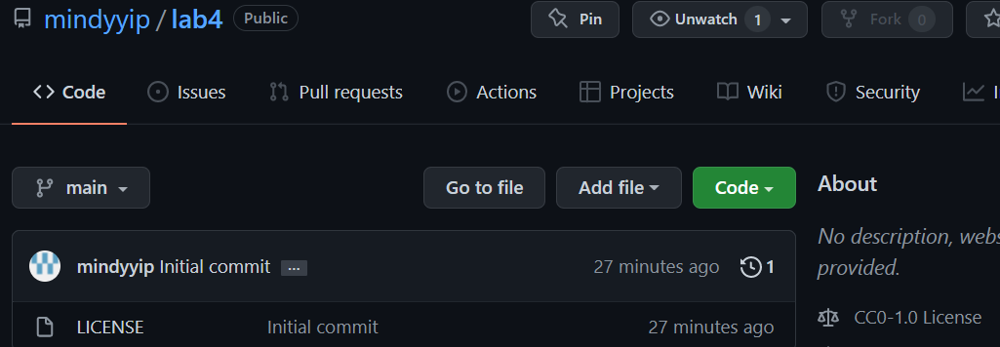

## Lab 4

This lab repository is given the Creative Commons license.

The four criteria for Free Software talks about some of the different freedoms with open source software. For example, it outlines the rules on running the program, changing the source code, and redistributing.

It is important to choose a license because it helps guide the rules and responsibilities for you and others that use your software. It is good to have a license when the open source software is being distributed and used in other programs so that everyone is using it legally. If not being used legally, then there can be some type of legal action taken against those.

It is important that you shouldn't use a project that doesn't have an explicit license because then it could be copyrighted. Without a license, this means that it could be illegal to use the project. If it's copyrighted, then it would not be allowable to do anything, including copying or distributing it.

After reading the article, I agree with the claim being made. There were a lot of issues with Gopher whereas the Web started to create relationships between content and structure. Gopher focused on pointers to documents while the Web did not.

Licenses are chosen based on the goals and philospohy of the project. For example, Linux used the GPL v2 license because it has less restrictions. The goal of Linux has to be bolstered by a license that has many permissions for distribution and commercial use, which is what Linux is used as today. Philosophies are important as well with what type of integrity you want your project to have.

[Link to Business Model Repository](https://github.com/schnur/RPIduino)

### 5 RCOS projects

|Website |License Present | License|
--------- | ------------- | -------|
|[Shuttle Tracker](https://github.com/wtg/shuttletracker)| Yes | AGPL-3.0|
|[Code Buddy](https://github.com/didioj/codebuddy)| Yes | MIT License|
|[MarketBot](https://github.com/markos373/marketbot)| Yes | MIT License|
|[Campus Map](https://github.com/sammkatcher/campusmap)| Yes | MIT License|
|[RPI Covid Scraper](https://github.com/johnnyapol/rpicovidscraper) | Yes | MIT License|

